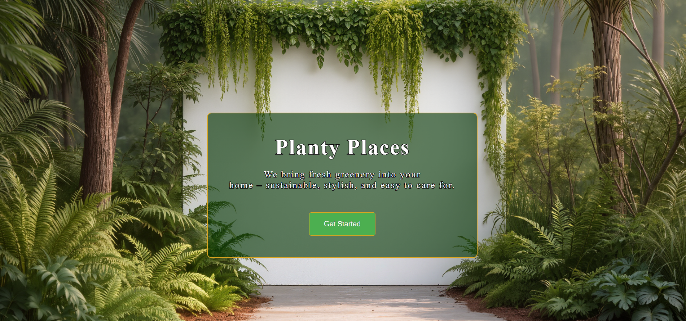
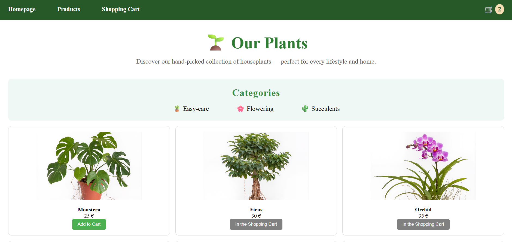
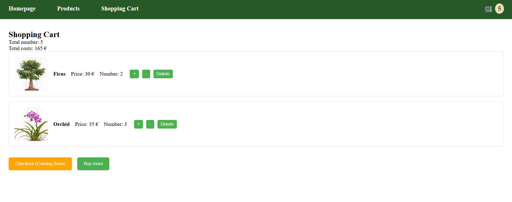

# 🌱 Planty Places – Houseplants Online Shopping Application

This is a **Plants Online Shopping Application** for a company called **Planty Places**.
This project is the final frontend assignment for the IBM course **Developing Front-End Apps with React** and simulates an online shop for houseplants. Users can browse plants, add them to a shopping cart, adjust quantities, and view a summary of their order. It's a responsive, accessible React + Redux frontend for a houseplant e-commerce experience.

---

## Project Overview

The application consists of three main pages:

1. **Landing Page**

   - Background image
   - Company name and short description
   - "Get Started" button linking to the product listing page

2. **Product Listing Page**

   - At least 6 unique houseplants available for sale
   - Each plant displays:

     - Thumbnail image
     - Plant name
     - Price
     - **Add to Cart** button with dynamic behavior:
       - Button becomes disabled after click
       - Plant is added to the shopping cart
       - Cart icon increases by one

   - Header includes:
     - Navigation links
     - Dynamic shopping cart icon showing total items

3. **Shopping Cart Page**
   - Displays all added plants
   - Shows:
     - Thumbnail, name, unit price
     - Total number of plants
     - Total cost
   - Features:
     - **Increase/Decrease** buttons to adjust quantities
     - **Delete** button to remove a plant
     - **Continue Shopping** button linking back to product page
     - **Checkout** button (shows “Coming Soon”)

---

## Technologies / Tech Stack

This project was built using the following technologies:

- **React** – Component-based UI library for building the application interface
- **Redux (Redux Toolkit)** – State management for shopping cart logic and product catalog
- **React Router** – Client-side routing between Landing, Product Listing, and Cart pages
- **JavaScript (ES6+)** – Core programming language
- **HTML5 & CSS3** – Structure and styling, including responsive design
- **Git & GitHub** – Version control and repository hosting

---

## 🧭 Quick start

1. **Clone repository:**
   ```bash
   git clone https://github.com/source-code-examples/houseplants-shop.git
   cd houseplants-shop
   ```
2. **Install dependencies:**
   ```bash
   npm install
   ```
3. **Run locally:**
   ```bash
   npm start
   ```
4. **Build for production:**
   ```bash
   npm run build
   ```
5. Open app: http://localhost:5173/houseplants-shop/

---

## 📂 Project Structure

houseplants-shop/
├── public/
│ └── images/ # Background image for landing page
├── src/
│ ├── assets/ # Static assets, plant thumbnails
│ ├── components/
│ │ └── Header
│ ├── data/
│ │ └── plantsData.js
│ ├── pages/
│ │ ├── LandingPage
│ │ ├── ProductListingPage
│ │ └── CartPage
│ ├── redux/
│ │ ├── store.js
│ │ └── cartSlice.js
│ ├── App.jsx
│ ├── main.jsx
│ ├── index.css # Global styles
│ └── index.html
├── package.json
└── README.md

---

## Deployment Info

The application is deployed and accessible at:

👉 [Planty Places – Live Demo](https://source-code-examples.github.io/houseplants-shop/)

---

## Screenshots

### Landing Page



### Product Listing Page



### Cart Page


